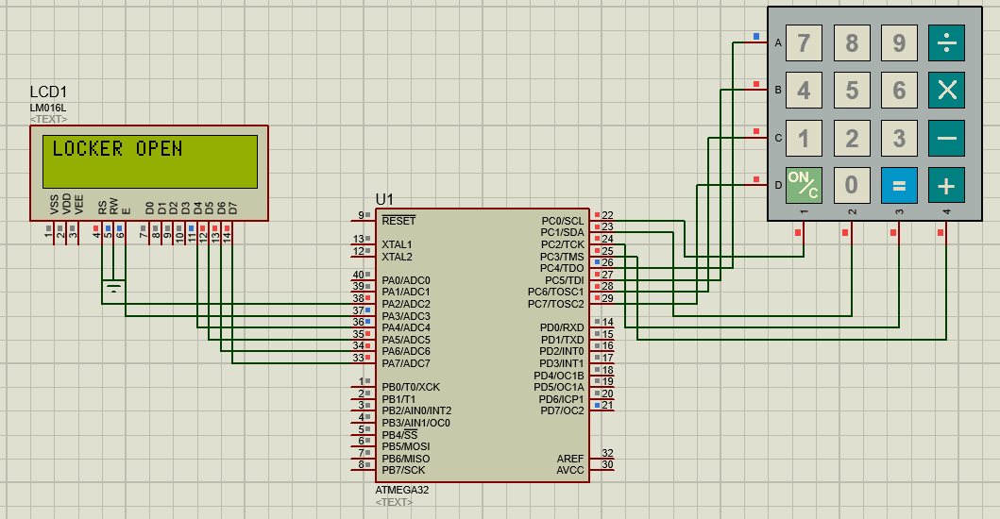

# Locker-System
Locker system for a safety.

## System Componenets
* Atmega32
* Keypad
* LCD

## Details
1. First time password saved is 0000.
2. User should enter 0000 to open locker at first time.
3. To change password user should press on ‘/’ user should enter 4 digit password then press on ‘/’ again to save password.
4. To close the locker, you should press only on ‘*’
5. To open the locker, enter 4 digit password (lcd display * each time you enter a digit for password, then display locker opened if right password and Try again if wrong password, re-enter password again.
6. To reset password: (locker must be in opened state): insert 10 zeros the password will back to default value which is 0000.

## Demo

### To open the locker

### To change the password

### To reset the password

